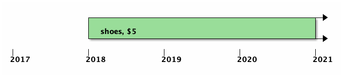
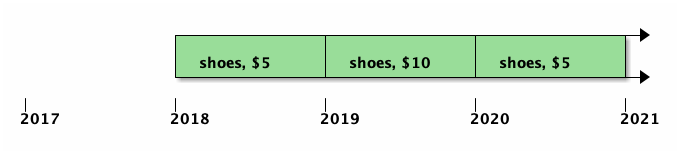
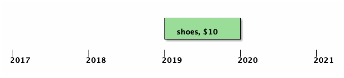
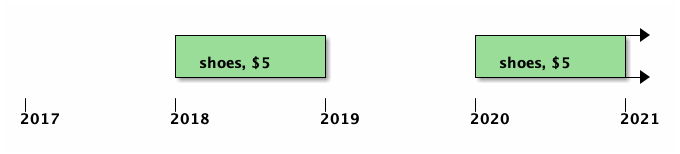
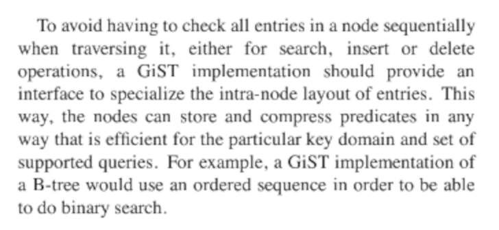
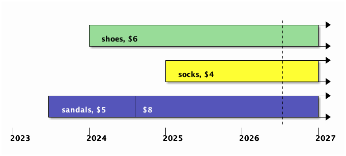
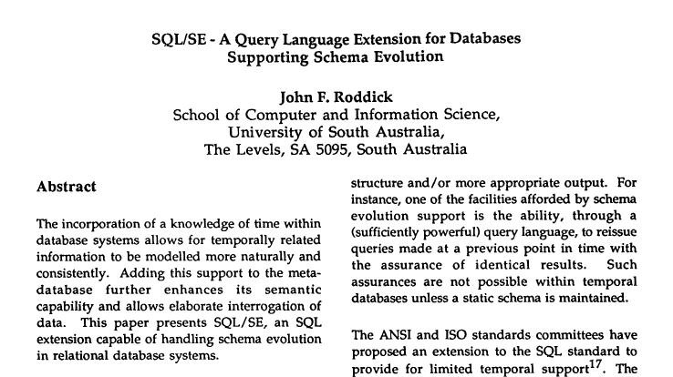

# Temporal Data Roadmap<br/>

Paul A. Jungwirth

PGConf.dev 2026

21 May 2026

Notes:

- Hi, I'm Paul Jungwirth, a freelance programmer from Portland, Oregon.
- I mostly build webapps, but sometimes I get to work on Postgres.
- Honestly coming to this conference is the highlight of my year.
- I've been working on SQL:2011 temporal features for several years, in particular application time.
- I want to talk about what we have, what's coming in v19, and most of all what else we could do.


# SQL:2011

|     |                                                 |
| --- | ----------------------------------------------- |
|  ☒  | `PRIMARY KEY` + `UNIQUE` `WITHOUT OVERLAPS`     |
|  ☒  | `FOREIGN KEY` `PERIOD`                          |
|  ☒  | `UPDATE/DELETE FOR PORTION OF`                  |
|  ☐  | `CASCADE/SET NULL/SET DEFAULT`                  |
|  ☐  | `PERIOD FOR valid_at (valid_from, valid_til)`   |
|  ☐  | `SYSTEM TIME`                                   |

Notes:

- Here are things laid out by the SQL standard.
    - Temporal primary and foreign keys got into v18.
        - We let you define these constraints on any rangetype column. Or it could be a multirange.
    - I've been working on temporal `UPDATE` and `DELETE` for v19, and they were merged last month.
    - I also have patches out there for letting temporal foreign keys cascade, and also for SQL:2011 PERIODs.
    - The `PERIOD`s patch doesn't add anything that ranges can't do, but it lets you write more standards-compatible SQL.
    - Under the hood it's really rangetypes.
- If all that gets in, Postgres will be the first RDBMS to support all of SQL:2011 application time.
- And then there is system time!
  - This is a big one.
  - Everything I've done has been for application time.
  - Application time lets you track changes to the thing out in the world.
  - System time lets you track who changed what when in your database.
    - Well "who" isn't in the standard, actually.
  - It's commonly used for compliance and auditing.
  - There are extensions that can give you this now, ....
  - and Corey Huinker is working on adding it to core.
  - I'd like to get this soon, so that you can have bitemporal tables.


# Beyond

|     |                                                 |
| --- | ----------------------------------------------- |
|  ☐  | Arbitrary Types                                 |
|  ☐  | FDWs                                 |
|  ☐  | Relational Ops: semijoin, antijoin, outer join, setops, aggregates |
|  ☐  | `MERGE`                                 |
|  ☐  | Optimizations                                 |
|  ☐  | `mdrange`                                 |
|  ☐  | Temporal DDL                                 |

Notes:

- Here's a quick list of the other stuff.
- This isn't in the standard, but it's mostly stuff you'd really want if you were working with a temporal database.
- I'm going to start with small cleanup things, move on to more ambitious projects, and finish with a couple more experimental ideas that don't really belong in core.


# Arbitrary Types
## PKs and UKs

```c
/* Discover the opclass's overlap operator: */
GetOperatorFromCompareType(
  opclass, InvalidOid, COMPARE_OVERLAP,
  &opid, &strat);
```

Notes:

- Postgres has a long history of extensibility. I think this is what the first researchers meant when they called it an "object-relational" database: you can define new types by implementing various interfaces to do what you want.
- So I think it would be great if we could support more than just ranges and multiranges.
- This might be useful for geometric types like Box or the types from PostGIS.
  - This feature can be useful for more than just time.
  - Or as we'll see later, I have my own use-case for multiple temporal dimensions.
- For a primary key or unique constraint, we are almost there. The main fill-in-the-blank core needs is an overlaps operator.
  - The issue is that core needs to ask the opclass for that operator.
  - In theory that's what strategy numbers are for, but those are only fixed for btree.
    - A GiST opclass can use whatever numbers it wants.
    - In fact core and our own `btree_gist` use different numbering schemes.
    - So we added a new gist support function for that.
    - So we ask the opclasses what stratnum implements a given "compare type".


# Arbitrary Types
## PKs and UKs

```sql
CONSTRAINT legacy_pk EXCLUDE
  (id WITH =, valid_at WITH &&)

CONSTRAINT shiny_pk PRIMARY KEY
  (id, valid_at WITHOUT OVERLAPS)
```
<!-- .element: class="fragment preload" data-fragment-index="0" -->

```sql
(5, 'empty')
(5, 'empty')
```
<!-- .element: class="fragment" data-fragment-index="1" -->

Notes:

- So that's solved, and I thought we would achieve arbitrary types, but in v17 another problem came up: empty ranges!
   - We had to add some custom code to reject empty ranges, which have no temporal meaning and allow duplicates to slip in to a supposedly-unique index.
   - Consider that a temporal unique constraint is equivalent to an exclusion constraint with equals on the first column and overlaps on the second, like this.
     If all those operators return true, then it's a "duplicate" and should be rejected.
     But these two constraints are not *quite* the same thing.
     The second actually forbids all duplicates, but the first one does not.
     See with ranges, empty never overlaps anything, even another empty.
     So for an empty range, that operator will always return false.
     That means you can have `(5, 'empty')` and `(5, 'empty')`, [SHOW] and it's allowed.
     But we can't allow that. A temporal unique constraint should be at least as restrictive as a regular one.
     If we did allow it, we would get duplicate rows in GROUP BY output, and probably other errors from the planner over-optimizing.
     So today we hardcode ranges and multiranges to forbid empties. (next slide)


# Arbitrary Types
## PKs and UKs

```c
switch (typtype)
{
  case TYPTYPE_RANGE:
    r = DatumGetRangeTypeP(attval);
    isempty = RangeIsEmpty(r);
    break;
  case TYPTYPE_MULTIRANGE:
    mr = DatumGetMultirangeTypeP(attval);
    isempty = MultirangeIsEmpty(mr);
    break;
  default:
    elog(ERROR, "WITHOUT OVERLAPS column \"%s\" is not a range or multirange",
       NameStr(attname));
}
```

Notes:

- Here is the code for that.
  - I know in C we don't mind switch statements as much, but still this grieves my Ruby-loving soul.
- How would we support other types here?
  - They could come with a function to reject invalid values.
    - Maybe that's another support function.
    - An IAM that wanted to support WITHOUT OVERLAPS would have a callback, and (in GiST's case) it would call the support function from the opclass to validate the value before using it.
    - The standard also says you shouldn't allow empty---or equivalently, the end has to come after the beginning. So I think we are looking for a generalization of that rule.
  - Alternately we could put the onus on the user to forbid these records manually, e.g. with a domain or check constraint.
    - But would users always get it right? It seems like a footgun.
    - I realized just last month we could have done this ourselves, by forbidding WITHOUT OVERLAPS constraints on ordinary ranges, and only allowing domains that forbid empties.
      - Postgres doesn't come with many domains out-of-the-box, but there are a few.
      - I like how that builds on existing generic features.
      - Maybe it would be too hard to check or annoying to use.
      - And it's complicated because a range isn't a type. The types are daterange, int4range, etc.


# Arbitrary Types
## Foreign Keys

```c[|1-2,11-13]
typedef struct RI_ConstraintInfo
{
  ...

  /* anyrange <@ anyrange */
  Oid   period_contained_by_oper;

  /* fkattr <@ range_agg(pkattr) */
  Oid   agged_period_contained_by_oper;

   /* anyrange * anyrange */
  Oid   period_intersect_oper;
}
```

Notes:

- Okay, foreign keys!
- Foreign keys also don't *quite* support arbitrary types, although I wish they did.
- They are so close. Already almost everything we need in core is provided by operators or support functions.
- The missing piece is an intersect operator.[SHOW]
- Unlike the others, we can't look this up by stratnum in `pg_amop`.
  - That table is for opclasses, and opclasses pertain to *indexes*.
  - This really has nothing to do with indexes.
  - Although I recently came across some place in the docs admitting that opclasses were already used for more than just indexes. I need to find that again.
  - But still, everything in `pg_amop` is either a "search" operator or an "ordering" operator. We call this the "purpose".
  - Intersects isn't either of those.
  - We could add a third purpose, but I think the bad fit is trying to warn us that wedging these into opclasses is the wrong approach.
- It seems like we need a "type support function".
  Apparently this same idea was raised last year for [Expanded Objects in PL/pgSQL](https://www.postgresql.org/message-id/2062830.1729625620%40sss.pgh.pa.us), and I heard maybe also for alternate units in window functions' frame positions.
  It's amazing how types have all kinds of callbacks, like in and out and send and recv, and many other things, but we don't have a formalizing concept covering them all, as we do with opclass support functions.
- And maybe opclass *is* the right place to put this.
  - That way users can override a type's normal behavior.
  - And since a foreign key always references a unique index, we could get the opclass from there.
  - But if we gave in to that temptation, we'd be stuck when it comes to....


# Aribtrary Types
<!-- .slide: data-transition="slide none" -->
## FOR PORTION OF

```sql
UPDATE t FOR PORTION OF valid at
   FROM '2019' TO '2020'
   SET price = 10;
```



`placeholder` <!-- .element: style="color:transparent" -->

Notes:

- `FOR PORTION OF`!
- This is for temporal update and delete.
- Here again we can *almost* support arbitrary types, but not quite.
- Just to review how this works, here is a row for a product....


# Aribtrary Types
<!-- .slide: data-transition="none none" -->
## FOR PORTION OF

```sql
UPDATE t FOR PORTION OF valid at
   FROM '2019' TO '2020'
   SET price = 10;
```



`placeholder` <!-- .element: style="color:transparent" -->

Notes:

- You want to raise the price just for one year.
- So your goal is to get this:
- This is three rows.


# Aribtrary Types
<!-- .slide: data-transition="none none" -->
## FOR PORTION OF

```sql
UPDATE t FOR PORTION OF valid at
   FROM '2019' TO '2020'
   SET price = 10;
```



`new = old * target`

Notes:

- This is how we get the updated row.
  - We make the requested changes,
    and we also change the start and end times.
- So we need an intersect operator, as you see here.
  - The history you ultimately change is the intersection of the bounds you target
    and the existing history in the record.
  - So if we solve that for foreign keys, we can use it here too.
  - But note that here we may not have any indexes at all, so that's another reason not to attach it to opclasses.


# Aribtrary Types
<!-- .slide: data-transition="none slide" -->
## FOR PORTION OF

```sql
UPDATE t FOR PORTION OF valid at
   FROM '2019' TO '2020'
   SET price = 10;
```



`leftovers = range_minus_multi(old, target)`
<!-- .element: style="white-space:nowrap" -->

Notes:

- The second thing we need is a way to get leftovers.
  - The standard says we insert extra rows to cover that history.
    - I call these new records "temporal leftovers".
    - It's basically range minus, except range minus fails if you cut a range into two parts.
    - So we have a helper function that does the same thing, but as a set-returning function.
      - It's called `range_minus_multi`.


# Aribtrary Types
## FOR PORTION OF

```c
if (get_opclass_opfamily_and_input_type(opclass, &opfamily, &opcintype))
  switch (opcintype)
  {
    case ANYRANGEOID:
      result->withoutPortionProc = F_RANGE_MINUS_MULTI;
      break;
    case ANYMULTIRANGEOID:
      result->withoutPortionProc = F_MULTIRANGE_MINUS_MULTI;
      break;
    default:
      elog(ERROR, "unexpected opcintype: %u", opcintype);
  }
else
  elog(ERROR, "unexpected opclass: %u", opclass);
```

Notes:

- Since it's a set-returning function, it can return as many leftovers as it needs.
  - For rangetypes this might be 0, 1, or 2.
  - For multiranges, where gaps are no problem, so it's always 0 or 1.
  - For user defined types, it could be any number. Imagine a 2-D or 3-D space, and you cut out a hole.
- Today we have this function for ranges and multiranges.
- We need a way for other types to offer it.
- Since there may be no index involved, we can't rely on opclasses.
- Both intersect and `minus_multi` could be found via type support functions.
- Okay that's it for arbitrary types.


# FDW<span style="text-transform:none">s</span>

```c
/* We don't support FOR PORTION OF FDW queries. */
if (targetrel->rd_rel->relkind == RELKIND_FOREIGN_TABLE)
  ereport(ERROR,
    (errcode(ERRCODE_FEATURE_NOT_SUPPORTED),
     errmsg("foreign tables don't support FOR PORTION OF")));
```

Notes:

- How about FDWs?
- Right now a temporal update/delete through a Foreign Data Wrapper isn't allowed.
- We should allow this and support it in `postgres_fdw`.
- The FDW implementation just has to react to the new node in the tree and use it on the other side.
- But if we just starting passing that, every existing implementation would miss it.
  - It would do a regular update instead of a temporal update.
- So I think we need a way for an implementation to assert what it's able to handle.
  - It could be like the properties `canorder`, `canmerge`, etc. on IAMs and indexes.
  - Maybe this exists already for FDWs; I haven't checked yet.
- I feel like FDW support is pretty easy, but it just needs a transition plan.


# Joins

```sql[|2-3]
SELECT  *,
        -- intersection:
        a.valid_at * b.valid_at AS valid_at
FROM    a
JOIN    b
ON      a.id = b.id
        -- overlaps:
AND     a.valid_at && b.valid_at;
```

Notes:

- Okay temporal joins: this is one of my favorite topics.
  - If you can't do joins, you don't have a database; you have a spreadsheet---and that's not fair to spreadsheets.
- SQL:2011 says nothing about how to do a temporal join, although there is research going back to the 70s.
- The issue is that when you join two rows, you want to know the new valid time. It's the intersection of the left row and the right row.[SHOW] Okay, that's easy to do.
- So that's inner join.
- But for the rest, we could really use some help.


# Semijoin

```sql[|4-9|2|]
SELECT  *,
        a.valid_at * b.valid_at AS valid_at
FROM    a
WHERE   EXISTS (
          SELECT  1
          FROM    b
          WHERE   a.id = b.id
          AND     a.valid_at && b.valid_at
        );
```

Notes:

- Here is a semijoin.
  Keep the a's that have a match in b, no problem. [SHOW]
  And then intersect the valid-times, as before. [SHOW]
  Oops.
  What's the problem?
  b isn't in scope out here. [SHOW]
- We need another plan.


# Semijoin

```sql[|5-7|2]
SELECT  a.id,
        UNNEST(multirange(a.valid_at) * j.valid_at) AS valid_at
FROM    a
JOIN (
  SELECT  b.id, range_agg(b.valid_at) AS valid_at
  FROM    b
  GROUP BY b.id
) AS j
ON a.id = j.id AND a.valid_at && j.valid_at;
```

Notes:

- Here is what actually works.
  We do a regular join, but we have to take care with one-to-many relationships,
  because even if `a` matches two or three `b`s, we still want it only *once* in the output.
  That's what the grouping is for. [SHOW subquery]
  It lets us combine all the matching `b`s into one multirange with `range_agg`. This prevents duplicating `a`.
- Then once all the matching bs are in one row, we intersect with `a`. [SHOW]
- Then to get back to rangetypes we `UNNEST` the multirange.
- You can imagine this would be a lot harder without multiranges.


# Antijoin

```sql[|5-9|2-3]
SELECT  a.id,
        UNNEST(CASE WHEN j.valid_at IS NULL THEN multirange(a.valid_at)
                    ELSE multirange(a.valid_at) - j.valid_at END) AS valid_at
FROM    a
LEFT JOIN (
  SELECT  b.id, range_agg(b.valid_at) AS valid_at
  FROM    b
  GROUP BY b.id
) AS j
ON a.id = j.id AND a.valid_at && j.valid_at
WHERE   NOT isempty(a.valid_at);
```

Notes:

- Antijoin is very similar.
- It has the same scoping problem, so that a correlated subquery doesn't work.
- The key difference is we use an outer join instead. [SHOW]
- Intuitively that should make sense: an antijoin needs to find what *doesn't match*, and that's what an outer join gives us.
- The result time is a little more complicated: [SHOW]
  - A partial match requires subtraction, but with no match at all we skip that.


# Outer Join

```sql[|1-5|7-21]
SELECT  a.*, b.*,
        UNNEST(multirange(a.valid_at) * multirange(b.valid_at)) AS valid_at
FROM    a
JOIN    b
ON      a.id = b.id AND a.valid_at && b.valid_at
UNION ALL
SELECT  a.*, (NULL::b).*,
        UNNEST(
          CASE WHEN j.valid_at IS NULL
               THEN multirange(a.valid_at)
               ELSE multirange(a.valid_at) - j.valid_at END
        )
FROM    a
LEFT JOIN (
  SELECT  b.id, range_agg(b.valid_at) AS valid_at
  FROM    b
  GROUP BY b.id
) AS j
ON      a.id = j.id AND a.valid_at && j.valid_at
ORDER BY 1, 5
;
```

Notes:

- The hardest of all is an outer join.
- Boris Novikov and I have traded a bunch of implementations for this.
- The most theoretically straightforward is to take an inner join[SHOW], then append an antijoin[SHOW]: everything that matches plus everything that doesn't match.
- But if I just write the SQL for that, say with UNION ALL, I wind up scanning both tables twice. That shouldn't be necessary.
- Boris found a delightful query that avoids double-scanning,
  but it's too large to fit into the margin of this slide.
- Fortunately you can find all these queries in my github repo called "temporal ops".
  It's in the references at the end.


# Encapsulating

```sql[|6|]
SELECT  a, b
FROM    temporal_semijoin(
          'a', 'id', 'valid_at',
          'b', 'a_id', 'valid_at'
        ) AS j(a a, b b)
WHERE   a.id = 5;
```

Notes:

- I think memorizing these SQL patterns is asking too much.
- We want to encapsulate them somehow. Like this.
- This function builds a SQL string using the passed-in table and column names,
  executes it, and returns the result.
- Here's the problem: this can't be a SQL function; it has to be PL/pgSQL or something similar.
  And those functions are opaque to the planner.
  Since the planner knows SQL, it can inline a SQL function and then do normal optimizations.
  Most important, it can push a qual down into the subquery, like this line here. [SHOW]
  With an opaque function definition, it can't do that.
  So this function will join every row in both tables, and then throw most of it away.
- That's no good either!


# Inlining

```c
typedef struct SupportRequestInlineInFrom                                                          
{                                                                                                  
  NodeTag     type;                                                                              
                                                                                                   
  /* Planner's infrastructure */                                     
  PlannerInfo *root;
  /* Function call to be simplified */                               
  RangeTblFunction *rtfunc;
  /* Function definition from pg_proc */                             
  HeapTuple   proc;
} SupportRequestInlineInFrom;
```

Notes:

- But in v19 we are getting a new support request, `SupportRequestInlineInFrom`.
- When you define a function, you can attach a "support function",
  which is a helper function that can answer questions for the planner,
  like "How many rows do you expect to return?" or "What is your selectivity?"
- I added a new support request so that a set-returning function can replace itself with an equivalent subquery. Then the planner can inline it just as it inlines SQL-language functions.


# `temporal_` `semijoin_sql`

```c
appendStringInfo(&q,
  "SELECT %2$s, UNNEST(multirange(%2$s.%3$s) * %4$s.%5$s) AS %6$s\n"
  "FROM %1$s\n"
  "JOIN (\n"
  "  SELECT ",
  left_nsp_rel_q, left_rel_q, left_valid_col_q,
  subquery_alias, right_valid_col_q, result_valid_col_q);
```

Notes:

- Here is a snippet from my support function in `temporal_ops`.
  - It's one of the nastiest parts I could find.
- Actually the support function and the main function share the same SQL-generating code,
  so we can be pretty sure they are equivalent.
- Note you don't have to build SQL strings; you could construct a node tree directly.
  But doing it this way makes things easy, and it lets you share code between the main function and support function.
  It offers a way for people to use the feature without being full-fledged Postgres contributors.
  Maybe there is even a way to define a general-purpose support function here, written in C, that delegates to yet another function just for building the string, and that could be in PL/pgSQL.
  - Then cloud users could take advantage of it.
  - The nicest way is probably to give arguments to support functions, as you can with triggers.


# Encapsulating

```sql
SELECT  a, b
FROM    temporal_semijoin(
          'a', 'id', 'valid_at',
          'b', 'a_id', 'valid_at'
        ) AS j(a a, b b)
WHERE   a.id = 5;
```

Notes:

- Btw maybe this is the wrong syntax.
- Here the table name parameters are declared as regclasses.
  - That's really nice, but how do I join 3 tables? Or a subquery?
- So maybe this?[SHOW]


# Encapsulating

```sql
SELECT  a, b
FROM    a
JOIN    b
ON      temporal_semijoin(a, b, a.id, a.valid_at, b.a_id, b.valid_at)
WHERE   a.id = 5;
```

Notes:

- Here the function is technically a predicate, but it's more like a declaration, so a post-analyze hook can rewrite the join.
- Now I don't need to use strings.
- I'm still figuring this out.
- I think we might need some kind of node type id just for extensions, so that they can survive various switch statements that error on nodes they don't recognize.


# Custom Scan

```c
typedef struct CustomScan
{
    Scan        scan;
    uint32      flags;
    List       *custom_plans;
    List       *custom_exprs;
    List       *custom_private;
    List       *custom_scan_tlist;
    Bitmapset  *custom_relids;
    const struct CustomScanMethods *methods;
} CustomScan;
```

Notes:

- That sounds a bit like a CustomScan!
  - Instead of transforming SQL, we could directly apply an optimal algorithm for getting what we want.
- I suspect there are two problems here:
  - Is the analyze phase is too early to inject CustomScans and CustomPaths?
  - Also, a CustomPath gives the planner an alternative to make something faster, but we need to add an extra output column.
  - Still, maybe we add the column in analysis and make sure the only path is from our CustomScan.
  - I'm sure other people have done similar things here, but I haven't yet looked at their work.


# In Core?

 <!-- .element style="width:100%" -->

Notes:

- Even better than a CustomScan would be to have this stuff in core!
- Of course there is no standard syntax for it.
- Some folks actually submitted a patch to do this, back in 2016.
- They responded to feedback for a year or two, but eventually they stopped posting updates.
- It might be worth resurrecting their patch, or maybe doing something else.
- I think we probably need something else.
- Their approach was very elegant, because they only needed two new primitive node types,
  and they showed that you could implement a temporal analogue to every relational operator by combining those two primitives with existing non-temporal operators.
  - But my guess is that the way they are transforming a temporal op into a whole tree of exec nodes is not optimal, a bit like doing it in SQL.


# Syntax: `valid_at`?

```sql[|3|4|1,3]
SELECT  a.*, combined_valid_at
FROM    a
LEFT JOIN b AS b (PERIOD combined_valid_at)
USING (id, PERIOD valid_at)
```

Notes:

- Coming back to this new extra column, how do you give it a name?
  - This is a syntax question.
- Here I'm showing two things:
  - First, note I'm using `LEFT JOIN` on purpose [SHOW], because as we saw, that's the hardest to do yourself in SQL.
  - Maybe `USING` [SHOW] has a `PERIOD` keyword and will use overlaps instead of equality.
  - And then maybe in the column list [SHOW] you can also use `PERIOD` to be the intersection of the two valid times.
    - You'd really like to get this without conflicting with the original valid-times.
    - Those are useful in aggregate functions, and probably they have other uses too.
      - Who knows what the user will do with them.
- With my PL/pgSQL functions, it wasn't an issue, because (1) I was returning separate rowtype values for the left & right inputs (2) the user has to give a column definition list as part of the FROM alias, so they can name the result valid-time whatever they want.
- Btw semijoin and antijoin are even worse as far as syntax, since SQL can't even do the *ordinary* operators without a periphrasis.


# Relational Algebra
<!-- .slide: style="font-size:75%; text-align:left" -->

> To your question on equivalence rules:
> Most traditional rules hold also for temporal operators,
> but there is a crucial difference.
> This difference regards whenever we access timestamps, so the **distributivity of selection**.
> Whenever we have a temporal join, we have two input tables with each one timestamp,
> but the output has only one which will be the intersection of these two timestamps.
> This means we modified/removed them and thus we cannot distribute selection over these timestamps,
> but we can over all other columns.

&mdash;Anton Dignös, 2025-11-26

Notes:

- If we implemented these joins in core, we would need to consider the algebraic identities we use to transform plan trees.
- I'm still researching this.
  - I've had some very helpful correspondence with Anton Dignös and Boris Novikov.
  - Snodgrass did great work on this in the 80s and 90s.
    - He developed a query language called TQuel, an extension to Quel, the query language of this old database---you may have heard of it---Ingres.
    - It turns out there are a ton of papers from that era proposing different temporal relational algebras.
      - They might treat time as bounded or unbounded, discrete or continuous, linear or branching.
      - They might structure the tuples with intervals, or sets of chronons, maybe even a different set of chronons for each attribute.
      - I found a paper from 1990 complaining about all the diversity.
      - People were publishing proofs about how one system is at least as powerful as another.
- In Snodgrass's system, if you define temporal relational operators, most rules are the same, but not all of them.
  - For instance Cartesian product does not distribute over difference.
  - And Dignös points out here that selection does not distribute over joins.
    - He means Codd's selection, not SQL SELECT.
    - In other words you can't always push down a qual.


# Relational Algebra
<!-- .slide: style="font-size:75%; text-align:left" -->

Q × (R − S) ≠ (Q × R) − (Q × S)
<!-- .element: style="text-align:center" -->

```lisp
LHS — (temporal-cartesian-product Q (temporal-except R S)):
+------+----------+------+-----------+-----------+
| q-id | valid-at | r-id | valid-at  | valid-at  |
+------+----------+------+-----------+-----------+
| q1   | (0 . 20) | r1   | (0 . 5)   | (0 . 5)   |
| q1   | (0 . 20) | r1   | (10 . 20) | (10 . 20) |
+------+----------+------+-----------+-----------+
RHS — (temporal-except (temporal-cartesian-product Q R)
                       (temporal-cartesian-product Q S)):
+------+----------+------+----------+----------+
| q-id | valid-at | r-id | valid-at | valid-at |
+------+----------+------+----------+----------+
| q1   | (0 . 20) | r1   | (0 . 20) | (0 . 20) |
+------+----------+------+----------+----------+
```

Notes:

- I made a little Racket library to play around with relational operators.
  - The github repo is in the references at the end.
- Here is the invalid identity Snodgrass points out.
- I think the problem is how the result keeps the old valid-times.
  - It treats them like they were ordinary attributes, but they are more like meta-attributes.
  - Ironically this was one of the big criticisms of an earlier SQL standardization effort.
  - And one of the important aspects in Dignös's work is precisely that operators yield a new valid-time while preserving the old, which is useful in scaling aggregate functions.
  - But it's striking how these were a problem for syntax, and a problem for CustomScans, and again for algebra.
  - I'm still figuring it out.
- If the algebra question interests you, I'd love to talk later.
  - I'm afraid I'm going to have to start coming up with my own math proofs,
    and I just make webapps, you know?


# Setops

```sql
-- temporal UNION:
SELECT  id, UNNEST(range_agg(valid_at)) AS valid_at
FROM  (
  SELECT * FROM a
  UNION
  SELECT * FROM b
) x
GROUP BY id
ORDER BY id, valid_at;
```

Notes:

- All these same ideas apply to `UNION`, `UNION ALL`, `INTERSECT` and `EXCEPT`.
- Those are in my temporal ops repo too.
- They're pretty easy to implement.
- Of course I'd like to have them encapsulated too.


# Aggregates

 <!-- .element style="width:100%" -->

Notes:

- What do you do with aggregates from a temporal table?
- First you split records so that all rows in a group have aligned start/end times.
- But then you might want to scale those rows' numeric values accordingly.
- For instance here are company budgets for different periods.
- If you change the period, you should change the budget.
- With `ALIGN` and `NORMALIZE` we can do this in core.
- Or Boris has published an article on doing it with PL/pgSQL, without needing to patch core.


# MERGE

```sql
MERGE INTO products
  FOR PORTION OF valid_at FROM t1 TO t2
  WHEN NOT MATCHED THEN INSERT ...
  WHEN MATCHED THEN UPDATE SET ...
;
```

Notes:

- Moving on....
- A temporal merge command would be so useful!
- As an application programmer, what you really want is a way to say, "P is true from t1 to t2,"
  and the database updates the existing history and *also* fills in any gaps with new rows.
- Of course this only works if you can supply values for all the NOT NULL columns,
  but I guess that's true for a regular merge too.
- So maybe the syntax is like this:
  - You give a `FOR PORTION OF` clause.
    - In the insert, we automatically set the valid-time column to fill any gaps.
      Note that you might be inserting more than one row, if you already have little islands of history.
    - In the update, we automatically do a `FOR PORTION OF`, so you don't update more than you want.
      The update could produce leftovers, which are *also* inserts, but they are guaranteed not to conflict with the insert.
      By definition leftovers are outside the targeted portion.
- I think this feature is pretty high priority.


# Optimizations

- Use btree
  - Skip scan?
- Improve gist
  - Binary search
- Range Merge Join
- Recognize snapshot queries
  - `n_distinct`
  - `GROUP BY`
- Self-Join Elimination
- More Algebra

Notes:

- Then there are lots of optimization opportunities.
- What are we giving up by using GiST indexes instead of B-Tree? I need to benchmark, but I suspect it's a lot.
  - Can we support temporal constraints backed by a B-Tree index?
    - I feel like there is some affinity with skip scans here, but so far it's just a vague feeling.
    - Maybe each type's overlaps operator can communicate how to transform itself into simple comparison operators, and btree uses that to find conflicting records.
      - I feel like there are big risks here, where we are breaking invariants btree depends on to squeeze out performance. I don't know.
- So maybe instead we just keep making GiST faster.
  - I'm sure there is a lot of optimization potential left there.
  - For instance today we scan *all tuples on the page* for a match.
  - Btree is able to use binary search to avoid that.


# GiST Binary Search

 <!-- .element style="width:100%" -->

Notes:

- One of the original GiST papers suggests that for datatypes with an ordering function, we could arrange their tuples so that binary search is possible.
  - In Postgres, GiST indexes have no concept of ordering.
  - But if they had an order, the GiST IAM could do a binary search, instead of testing every tuple in an index page.
  - They would just need to guarantee that the consistent function was compatible with the ordering function.
  - Also this means that (some) GiST indexes could claim to be orderable, which would let them more easily be inputs to merge joins.
  - In fact GiST opclasses *already* have an optional `sortsupport` function,
    but it is only used to speed up the initial index build.
    Still, if GiST indexes can use that to preserve sorting as they evolve,
    then binary search should be possible.
  - This also (possibly) relates to work I'm doing to let GiST indexes support uniqueness.


# Range Merge Join

- 2012: Jeff Davis, "9.3 Pre-Proposal"
- 2017: Jeff Davis, "Range Merge Join v1"
- 2020: Thomas Mannhart, BSc Thesis
- 2021: Thomas Mannhart, "Patch: Range Merge Join"
- 2021: Anton Dignös et al, ""Leveraging range joins for the computation of overlap joins"

Notes:

- RangeMergeJoin is another optimization.
- Since most temporal joins use overlaps, it'd be great if we had a fast way of doing this.
- Jeff Davis worked on this as early as Postgres 9.3, and he had a very high-quality patch in 2017.
  - But then he withdrew it because it didn't handle multiple range dimensions.
- Later Thomas Mannhart submitted a patch with a similar idea.
  - Both patches work by extending our MergeJoin strategy.
- Thomas's patch only does contains, not overlaps, but his advisors published this last paper showing how to get overlaps from two contains joins, unioned together.

- Of course they require sorted inputs.
  - Since your indexes are probably GiST, not btree, this is another reason why getting ordering into GiST would be great.

(NEXT)


# Range Merge Join
<!-- .slide: style="font-size:60%; text-align:left" -->

> The problem is this: the algorithm for a single key demands that the
> input is sorted by (lower(r) NULLS FIRST, upper(r) NULLS LAST). That's
> easy, because that's also the sort order for the range operator class,
> so everything just works.
> 
> For multiple keys, the order of the input is:
>
> ```sql
> lower(r1) NULLS FIRST, lower(r2) NULLS FIRST,
> upper(r1) NULLS LAST, upper(r2) NULLS LAST
> ```
> 
> But that can't match up with any opclass, because an opclass can only
> order one attribute at a time. In this case, the lower bound of r2 is
> more significant than the upper bound of r1.

&mdash;Jeff Davis, 2017-09-17

Notes:

- I read both patches. I had Claude rebase both on the latest master.
  - I think I like Jeff's better.
  - It supports Contains, ContainedBy, and Overlaps "natively"; it doesn't need to rewrite the query as a UNION ALL to get Overlaps.
    - I think most temporal joins are going to need Overlaps.
  - The Dignös join has very impressive benchmarks compared to GiST. On the other hand not using GiST is sort of a problem for us.
  - Jeff's patch is far more commit-ready.
  - The Mannhart patch is maybe more sophisticated in how it generates paths.
- Here is the outstanding problem that made Jeff abandon his patch:
  - If you are dealing with *two* ranges, you can't get an opclass to give you the sorting you need.
  - He mentioned spatial, but I don't think anyone is going to use rangetypes for that.
    GIS has its own types; it doesn't use range types.
    A two-dimensional type doesn't have the problem he describes here: the opclass can see both dimensions at once.
    It would still need an ordering that is consistent with overlaps; I'm just starting to think about that.
  - Two rangetypes might matter for bitemporal tables.
    - But probably not, IMO: (1) just finding each range's overlaps independently doesn't get you all the way there anyway (2) usually you want to filter by one range and join by the other. So I'm not sure that's really a use-case.
  - The Mannhart and Dignös method doesn't solve this either, btw.


# Snapshot Queries



Notes:

- And outside of IAMs, I think the planner could learn a lot about temporal query structure.
  - The most common question is asking what is true *right now*.
    - These are often called "snapshot queries".
      - I know that's not the best term within Postgres.
      - Snodgrass in the 90s called them "time-slice queries".
    - They got a special name because they have special properties.
    - In such a query, a temporal table goes in and a non-temporal table comes out.
    - So now the scalar parts of your temporal constraints are alone sufficient to guarantee uniqueness.
  - I'm sure there are missed optimization opportunities here.
    - It's a new feature; there should be a lot of low-hanging fruit.
    - For instance index statistics track `n_distinct`.
      - Temporal indexes could track `n_scalar_distinct`, which is the same thing but ignoring the valid-time column.
      - Then if we have a snapshot query we could use that.
      - Or we could compute `n_distinct` just for the current time as of running analysis,
        since that will usually be what gets queried.
      - Or we could have multiple `n_distinct` values for different time spans, so it's accurate for whatever time you're targeting.
  - And the improvements are not limited just to optimizations:
    - Here's one: functional dependencies in aggregate queries.
      - When you `GROUP BY`, you're allowed to select non-grouping columns if Postgres can prove that they are "functionally dependent" on the grouping columns.
        - For instance if I group by product id (say because I'm joining to all its sales), I can still select the product name.
      - In a snapshot query, that should still work, even though of course I'm not grouping by the valid-time.

- The common pattern here is that in a snapshot query, the temporal primary key "decays" to a primary key with just its scalar columns.


# Self-Join Elimination

<!-- .slide: style="font-size:60%; text-align:left" -->

> Hi Hackers,
>
> relation_has_unique_index_for() checks whether join clause equality
> operators belong to the index's opfamily via mergeopfamilies.  Since
> mergeopfamilies only lists btree opfamilies, this check always fails
> for GiST-backed unique indexes such as those created by PRIMARY KEY
> with WITHOUT OVERLAPS, preventing self-join elimination.
> 
> Fix by falling back to op_in_opfamily() when the mergeopfamilies check
> fails.  The clause is already known to be a mergejoinable equality, so
> confirming the operator is registered in the index's opfamily is
> sufficient to prove that the index's uniqueness guarantee applies.
> 
> Attached a patch to fix this and added corresponding tests.

&mdash;Satyanarayana Narlapuram, 2026-04-21

Notes:

- And I wanted to call out this patch from just a few weeks ago.
  - We miss an opportunity for self-join elimination because the primary key is GiST, not btree.


# More Algebra

`(a * b) @> t = (a @> t AND b @> t)`
<!-- .element: style="text-align:center" -->

```sql
SELECT  c.valid_at
FROM    (
  SELECT  a.valid_at * b.valid_at AS valid_at
  FROM    a JOIN b
  ON      a.valid_at && b.valid_at) AS c
WHERE   c.valid_at @> current_date;
```

Notes:

- Another practical use for algebra would be relationships between rangetype operators,
  especially intersect, overlaps, and contains.
- If the planner understood this, it could push down conditions more often.
  - In this example, we could push down the contains filter to the base rels,
    but Postgres would need to understand that contains distributes over intersect.
  - We want to push down the condition that `a.valid_at` contains `current_date`
    and `b.valid_at` contains `current_date`.
- And btw this identity only holds if `t` is a base type.
  - If `t` is another range, then it might be `'empty'`, and that messes things up.
- Is it realistic to build these rules into the planner? I don't know.


# mdrange
<!-- .slide: data-transition="slide none" -->

```sql
CREATE TYPE mdrange AS (
  INPUT = mdrange_in,
  OUTPUT = mdrange_out,
  ...
);
```

Notes:

- Now for some stuff that's less practical.
- Everyone who gets excited about temporal tables eventually asks, "What about tri-temporal? quad-temporal?"
  - Why only two dimensions?

- One use-case is you have different people making truth claims, and you want to track all of them.
- This is sort of halfway in between application time and system time:
  - System time is about the database.
  - Application time is about the thing in the world.
  - This is about who was talking about the thing in the world.
  - If relational theory comes from Aristotle, now we're on Heidegger.
- Well, circling back to the beginning, if we supported arbitrary types, everything is there already.
- Imagine you have a new type called mdrange.
  - That's md for multi-dimensional.
- It contains all its own logic about how to do overlaps, intersects, minus-multi, etc.
  - Recall how for RangeMergeJoin, the problem was that an opclass can't consider two dimensions at once to do its ordering, but with a single `mdrange` value it could.
- This is pretty ivory tower, but I still want to build an extension for it.


# mdrange
<!-- .slide: data-transition="none slide" -->

```sql
CREATE PSEUDOTYPE mdrange AS (
  ??? = ???,
  ??? = ???,
  ...
);
```

Notes:

- Btw this is really another pseudotype. Should we have user-defined pseudotypes??


# DDL Changes



Notes:

- The other thing every author mentions is temporal DDL.
  - How do you deal with historical data when your table structure changes?
  - At this point everyone just sort of waves their hands and says it's a hard problem.
  - But I've finally found a couple papers that talk about it!
    - Snodgrass's TQuel paper covers it.
    - This other one from 1992 gives a fuller treatment.

- Snodgrass points out that temporal DDL is really only about system time: when did the database change? (Page 168 of *Temporal Databases*).
- Okay, I think I agree, but you still have to deal with valid-time tables when your schema changes.
- This other paper involves both dimensions.
  - Basically the idea is that your catalog tables are temporal tables too.
  - Okay don't walk out.
    - You're right, this is even less practical than mdranges.
  - But the paper actually takes that approach.
    - At (transaction) time x, we thought the schema at (valid) time y was S.

- It supports adding and dropping columns.
- As far as I can tell it doesn't support changing the type of a column.
  - Or dropping a column then adding it back with a different type.
  - I'm sure there are lots of other hard scenarios you can imagine.
- And btw, what does the table's file layout look like?

- I can't imagine Postgres ever does this.
- But can we at least move the old data into the new format?
- For system time it's pretty desirable.
  - Otherwise a system table can't ever handle DDL!
  - With application time, migrating old data is the user's job.
  - With system time, it's our job.
  - Corey and I have had several conversations about how to deal with it.
  - You'd like to think databases could handle every situation . . .


# DDL Changes


Notes:

- Maybe the best we can do is detach the history table and start a new one,
  or better, document that users should do that.
- So what about application time?
- This isn't our job, but I think it would be great to publish useful ways to migrate your old data when you want to make various kinds of DDL change.
  - Adding a column.
  - Changing a column's type.
  - Making a column NOT NULL. (This is probably not any harder than for non-temporal tables.)
  - Converting a one-to-many to many-to-many.
- Of course, it would be nice to have procedures for all these things for non-temporal tables too.


# References
<!-- .slide: class="references" -->

- John F. Roddick. "SQL/SE - A Query Language Extension for Databases Supporting Schema Evolution." SIGMOD RECORD, 1992. https://dl.acm.org/doi/epdf/10.1145/140979.140985
- Alexander Tuzhilin and James Clifford. "A Temporal Relational Algebra as a Basis for Temporal Relational Completeness." VLDB, 1990. https://www.vldb.org/conf/1990/P013.PDF
- Richard Snodgrass. "An Overview of TQuel." *Temporal Databases: Theory, Design, and Implementation*, 1993.
- Marcel Kornacker, C. Mohan, Joseph M. Hellerstein. "Concurrency and recovery in generalized search trees." SIGMOD, 1997. https://dl.acm.org/doi/10.1145/253260.253272
- Anton Dignös, Michael H. Böhlen, Johann Gamper. "Temporal Alignment." SIGMOD, 2012. https://files.ifi.uzh.ch/boehlen/Papers/modf174-dignoes.pdf
- Jeff Davis. "9.3 Pre-Proposal: Range Merge Join." pgsql-hackers, 2012. https://www.postgresql.org/message-id/1334554850.10878.52.camel%40jdavis
- Ali Piroozi. "Equivalence Rules" pgsql-hackers, 2014. https://www.postgresql.org/message-id/CAMi-Eo1Wrxft=0ZsvKkZRYkoFVGRnbhbjL6a=rUf58xOGuj7DA@mail.gmail.com
- https://github.com/postgres/postgres/blob/master/src/backend/optimizer/README
- Anton Dignös, Michael Hanspeter, Johann Gamper, Christian S. Jenson. "Extending the Kernel of a Relational DBMS with Comprehensive Support for Sequenced Temporal Queries." ACM Transactions on Database Systems, 2016. https://dl.acm.org/doi/10.1145/2967608
- Anton Dignös. "Temporal query processing with range types." pgsql-hackers, 2016. https://www.postgresql.org/message-id/CALNdv1h7TUP24Nro53KecvWB2kwA67p+PByDuP6_1GeESTFgSA@mail.gmail.com
- Jeff Davis. "Range Merge Join v1." pgsql-hackers, 2017. https://www.postgresql.org/message-id/CAMp0ubfwAFFW3O_NgKqpRPmm56M4weTEXjprb2gP_NrDaEC4Eg%40mail.gmail.com
- Thomas Mannhart, Anton Dignös. "A General-purpose Range Join Algorithm for PostgreSQL." BSc thesis, 2020. https://tpg.inf.unibz.it/downloads/rmj-report.pdf
- Danila Piatov, Sven Helmer, Anton Dignös, Fabio Persia. "Cache-efficient sweeping-based interval joins for extended Allen relation predicates." VLDB 2021. https://link.springer.com/content/pdf/10.1007/s00778-020-00650-5.pdf
- Thomas Mannhart. "Patch: Range Merge Join." pgsql-hackers, 2021. https://www.postgresql.org/message-id/CAMWfgiAsJgVrkbrsv740Y2%3D2duO4rVYRhaD08EhFqBuJFmBH1A%40mail.gmail.com
- Anton Dignös, Michael H. Böhlen, Johann Gamper, Christian S. Jensen, Peter Moser. "Leveraging range joins for the computation of overlap joins." VLDB, 2021. https://link.springer.com/content/pdf/10.1007/s00778-021-00692-3.pdf
- Paul Jungwirth. Temporal Ops Postgres Extension. https://github.com/pjungwir/temporal_ops
- Boris Novikov. "PostgreSQL Temporal Aggregates: SUM, AVG & COUNT Across Time." Red Gate, 2024. https://www.red-gate.com/simple-talk/databases/postgresql/making-temporal-databases-work-part-2-computing-aggregates-across-temporal-versions/
- Satyanarayana Narlapuram. "Allow SJE to recognize GiST-backed temporal primary keys." pgsql-hackers, 2026. https://www.postgresql.org/message-id/CAHg%2BQDeXwdOzrmb-sSATK4whbyhOgzyCGN%2BbY%3DYXU9qOzJaWSg%40mail.gmail.com
- Paul Jungwirth. Racket Library for Relational Operators. https://github.com/pjungwir/relsim
- Paul Jungwirth. These slides. https://github.com/pjungwir/temporal-roadmap

Notes:

- Okay, here are links to stuff I've covered.


# Thanks

https://github.com/pjungwir/temporal-roadmap

Notes:

- Thanks for listening!
- I feel like there is enough here to keep me busy for years.
- If you are excited about any of this, let's collaborate!
  - Of course even reviews are very welcome.
- Or if you want to hire me to work on it, that would be exciting too.
  - Just doing binary search in GiST indexes would be awesome.
